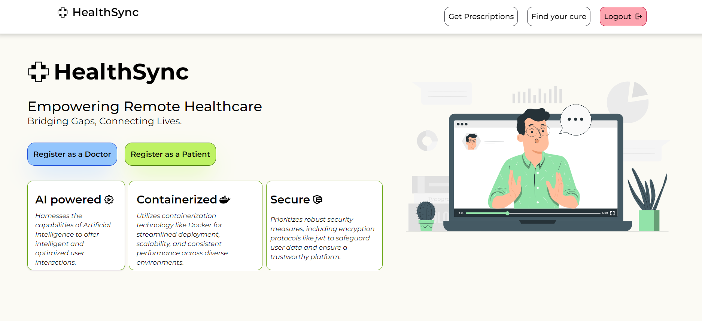
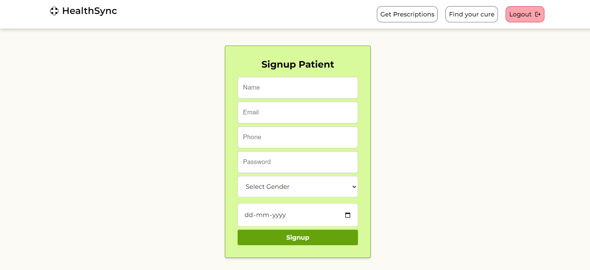
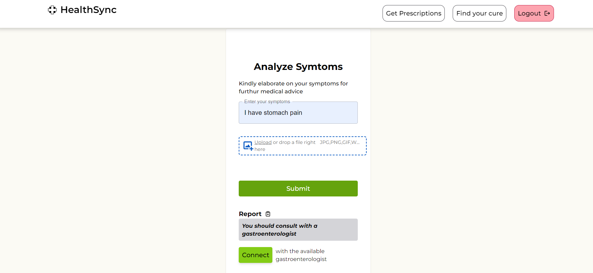
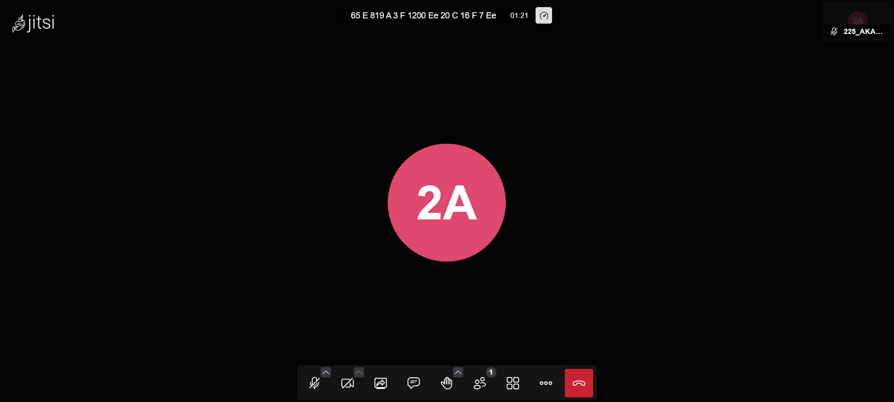
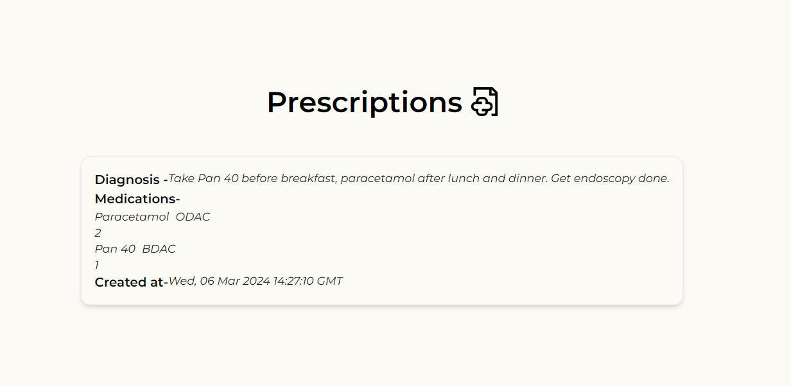
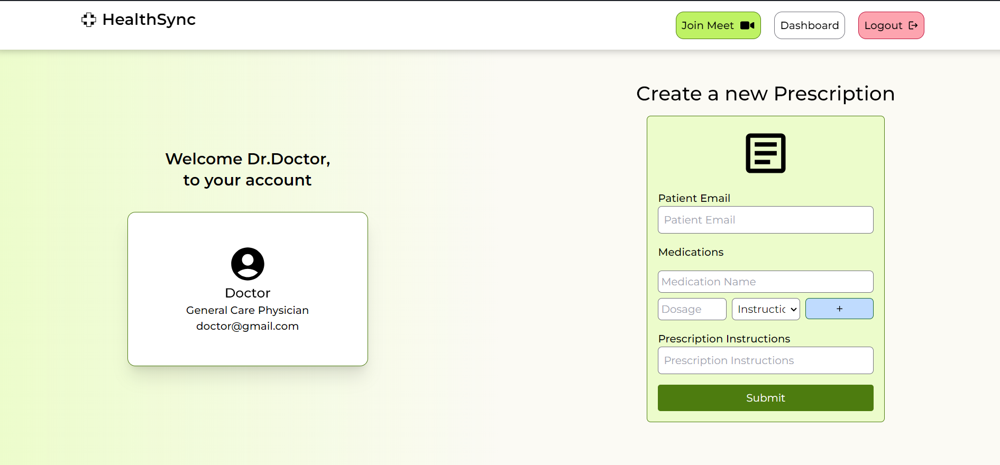

# HealthSync 


Welcome to HealthSync, your comprehensive healthcare solution powered by artificial intelligence. 



## Table of Contents

- [About](#about)
- [Features](#features)
- [Installation](#installation)
- [Usage](#usage)
- [Contributing](#contributing)


## About

With HealthSync, you can upload images, describe your symptoms, and engage in video consultations with qualified healthcare professionals—all from the comfort of your home. Our secure platform prioritizes patient confidentiality and data privacy, adhering to the highest standards of security and compliance. You can get the prescriptions as pdf in your email, and in your personal account in HealthSync application.

Join us on the HealthSync journey as we revolutionize healthcare delivery, one patient at a time. Experience the convenience, efficiency, and effectiveness of AI-driven healthcare with HealthSync today.


## Features

- AI powered.
- Automatic symptom analysing, Image recognition, Telemedecine
- Prescriptions as PDFs
- Dockerised, Secure and Safe

## Installation

Instructions for installing and setting up the project locally.

1. Clone the repository:
   ```sh
   https://github.com/Ne0sky/healthsync.git
   cd healthsync
   npm install
## Usage (Patient)

1. Make account as a patient 

2. Enter symptoms and/or related images

3. Connect with referred doctor

4. Get your prescriptions


## Usage (doctor)

1. Make account as a doctor 

2. Enter prescription details for the patient

3. Enter prescription details for the patient


## Contribution Guide

Thank you for considering contributing to [Project Name]! Here's how you can get started:

- Reporting Bugs: If you encounter any bugs or issues, please open a new issue on our issue tracker and provide detailed information about the problem.

- Suggesting Enhancements: We welcome suggestions for new features or improvements. Feel free to open an issue to propose your ideas.

- Contributing Code: If you'd like to contribute code, fork the repository, make your changes, and submit a pull request. Ensure your code follows our coding standards and includes tests if applicable.

- Code Review: All pull requests will undergo code review by project maintainers. Feedback may be provided to ensure code quality.

If you have any questions or need assistance with contributing, feel free to reach out to us. We appreciate your contributions!